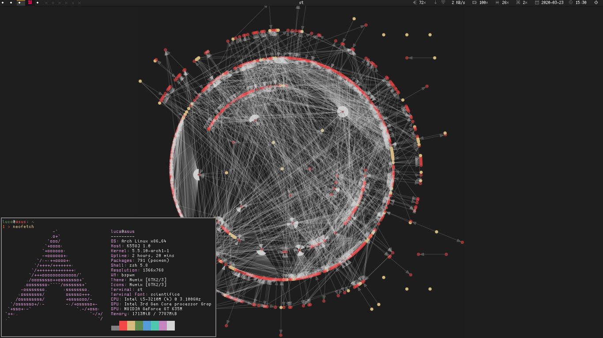
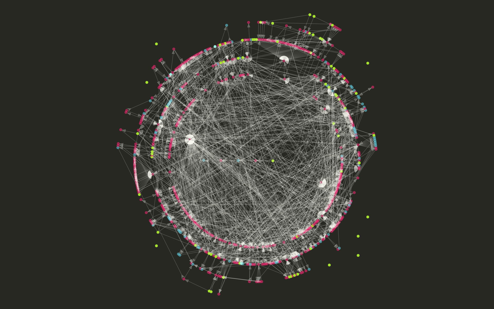

``pacwall.sh`` is a shell script that changes your wallpaper to the dependency
graph of installed packages. Each package is a node and each edge indicates a
dependency between two packages.

An `AUR package`_ is available.

.. contents:: Navigation:
   :backlinks: none

------------
Highlighting
------------

* Packages

  +---------------------+--------------------+---------+----------+
  | Package/Distro      | Arch               | Void    | Debian*  |
  +=====================+====================+=========+==========+
  | Normal              | translucent red                         |
  +---------------------+-----------------------------------------+
  | Explicitly installed| solid orange                            |
  +---------------------+------------------------------+----------+
  | Orphans             | solid magenta                | X        |
  +---------------------+--------------------+---------+----------+
  | Foreign (AUR, etc.) | solid "Arch" blue  | X                  |
  +---------------------+--------------------+--------------------+
  | Virtual (see below) | translucent violet | X                  |
  +---------------------+--------------------+--------------------+

* Dependencies

  * **A** *depends on* **B**: an arrow that points towards **B**
  * **A** *provides* **B** (**B** is a *virtual* package):
    an inverted arrow that points towards **B**
    (*applies only to Arch*)

------------
Requirements
------------

~~~~~~~~~~
Arch Linux
~~~~~~~~~~

.. code-block:: bash

    sudo pacman -Syu --needed graphviz pacman-contrib

~~~~~~~~~~~~~~~~~~~~~~~~~~~~~~~~~~
Debian, Ubuntu, Mint, Pop!_OS, ...
~~~~~~~~~~~~~~~~~~~~~~~~~~~~~~~~~~

.. code-block:: bash

    sudo apt install graphviz

~~~~~~~~~~
Void Linux
~~~~~~~~~~

.. code-block:: bash

    sudo xbps-install -S graphviz

~~~~~~~~~~~~~~~~~~
Wallpaper backends
~~~~~~~~~~~~~~~~~~

``pacwall`` tries to set the wallpaper using ``feh`` and ``hsetroot``.

-------------------------------
Desktop environment integration
-------------------------------

Use ``-D`` to enable desktop environment integration (KDE Plasma, GNOME, ...).
You will be able to see the generated wallpapers in the graphical wallpaper picker.

DE integration requires ``imagemagick`` and ``xorg-xdpyinfo``
(If you are on Wayland you need to specify the screen size manually like this:
``./pacwall.sh -DS 1920x1200``).

**WARNING**:
Setting a wallpaper in GNOME and the derivatives isn't possible with ``feh`` and ``hsetroot``.
``-D`` is *required*.
(If you don't know your DE, it is probably GNOME)

-----------------
Pywal integration
-----------------

Run ``./pacwall.sh -W`` to use colors set by pywal.
The image above shows monokai pywal theme.

-------------
Customization
-------------

Customizations can be made on the commandline, see the options with
``./pacwall.sh -h``.

.. code-block::

    USAGE: pacwall
            [ -iDW ]
            [ -b BACKGROUND_COLOR ]
            [ -d NODE_COLOR ]
            [ -e EXPLICIT_NODE_COLOR ]
            [ -p ORPHAN_NODE_COLOR ]
            [ -f FOREIGN_NODE_COLOR ]
            [ -y VIRTUAL_NODE_COLOR ]
            [ -s EDGE_COLOR ]
            [ -c ROOT ]
            [ -r RANKSEP ]
            [ -g GSIZE ]
            [ -o OUTPUT ]
            [ -S SCREEN_SIZE ]
            [ REPO:COLOR ... ]
            [ GROUP%COLOR ... ]
            [ PACKAGE@COLOR ... ]

            Use -i to suppress wallpaper setting.
            Use -D to enable integration with desktop environments.
            Use -W to enable pywal integration.

            All colors may be specified either as
            - a color name (black, darkorange, ...)
            - a value of format #RRGGBB
            - a value of format #RRGGBBAA

            ROOT is the package that will be put in the center of the graph.
            RANKSEP is the distance in **inches** between the concentric circles.
            GSIZE is deprecated, you probably want to set RANKSEP instead.
            OUTPUT is the relative to CWD path of the generated image.
            SCREEN_SIZE makes sense to set only if -D is enabled and you're on Wayland.

            REPO:COLOR overrides the highlight color for packages from REPO to COLOR.
            GROUP%COLOR overrides the highlight color for packages from GROUP to COLOR.
            PACKAGE@COLOR overrides the highlight color for PACKAGE to COLOR.

Additional customizations can be performed by modifying the script itself.
The code in the script is well-structured (should be).
To discover the customization possibilities, read the man page of ``graphviz``
and ``twopi``, particularly the section on *GRAPH, NODE AND EDGE ATTRIBUTES*.

---------------
Troubleshooting
---------------

If the graph is too large, use ``-r``.
For example, ``-r 0.3`` means that the distance between the concentric circles
of the graph will be 0.3 **inch**.

An alternative method is to use ``-g``.
The format should be the same as the ``twopi`` ``-Gsize`` option. ``7.5,7.5``
for example forces the graph to be not wider nor higher than 7.5 **inches**.

------------
Contributors
------------

* `Nazar Vinnichuk`_: the original author and maintainer;
* `PitcherTear22`_: integration with GNOME and other DEs, first ever rice_ with pacwall;
* `John Ramsden`_: PKGBUILD, cmdopts parsing, general code quality;
* `Ruijie Yu`_: PKGBUILD, sudo mode;
* `AugustUnderground`_: Void support;
* `Luca Leon Happel`_: pywal integration, ``hsetroot`` backend;
* `QWxleA`_: screen size autodetection via ``xdpyinfo``;

----------------
Similar software
----------------

* pacgraph_
* pacvis_

.. LINKS:
.. _AUR package: https://aur.archlinux.org/packages/pacwall-git/
.. _Nazar Vinnichuk: https://github.com/Kharacternyk
.. _PitcherTear22: https://github.com/PitcherTear22
.. _John Ramsden: https://github.com/johnramsden
.. _Ruijie Yu: https://github.com/RuijieYu
.. _AugustUnderground: https://github.com/AugustUnderground
.. _Luca Leon Happel: https://github.com/Quoteme
.. _QwxleA: https://github.com/QWxleA
.. _rice: https://www.reddit.com/r/unixporn/comments/fnfujo/gnome_first_rice_pacwall/ 
.. _pacgraph: http://kmkeen.com/pacgraph/
.. _pacvis: https://github.com/farseerfc/pacvis
